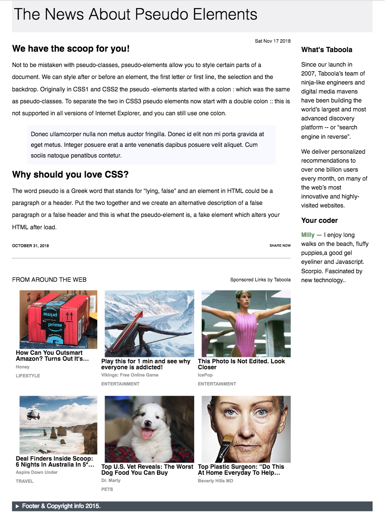

## Code Challenge: Mockup to a Widget

In this project I used a picture of a webpage with an advert widget and recreated it using simple html, css and js. The information is fetched from an API with an `XMLHttpRequest()` and displayed without any special frameworks or libraries.

### Technologies Used

-   HTML
-   CSS
-   JavaScript
-   An API from the magical internet.

### Screenshot

live demo @ [JSBin](https://jsbin.com/lubedik)

